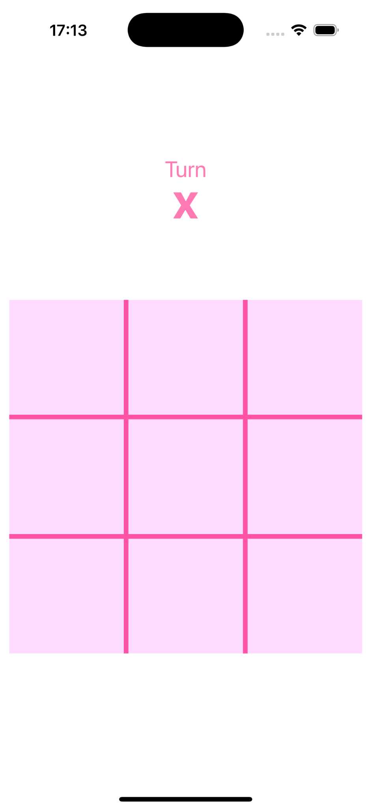
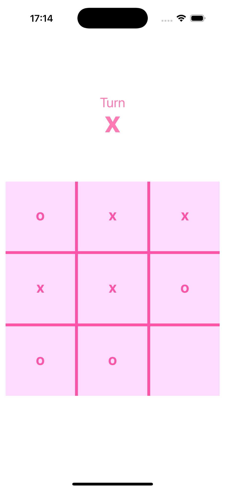
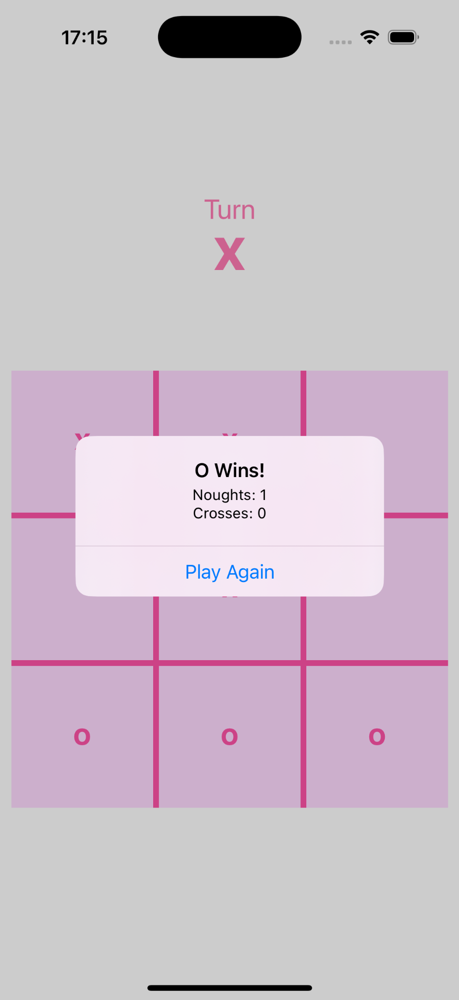

# TicTacToe-iOS

A simple Tic Tac Toe game built with UIKit using the MVC architecture.

## Features
- 2-player Tic Tac Toe (X vs O)
- Turn indicator
- Win detection (rows, columns, diagonals)
- Draw detection
- Score tracking
- Play again (alternates the starting player)

## Screenshots

  
  
  

## Architecture (MVC)
- **Model**: `TicTacToeModel`
- **View**: `Main.storyboard`
- **Controller**: `ViewController`

## Tech Stack
- Swift
- UIKit
- Storyboard + Auto Layout

## Author
Azniv Mkrtchyan

